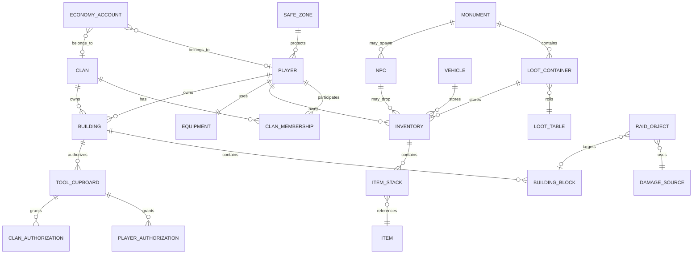
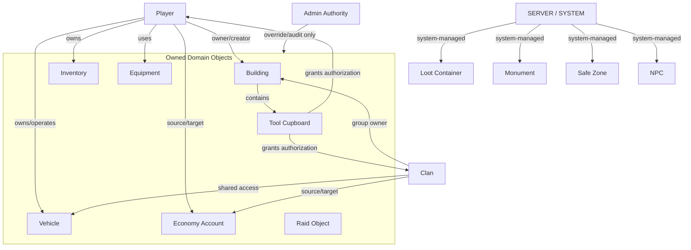
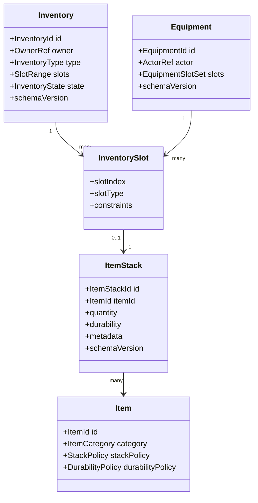
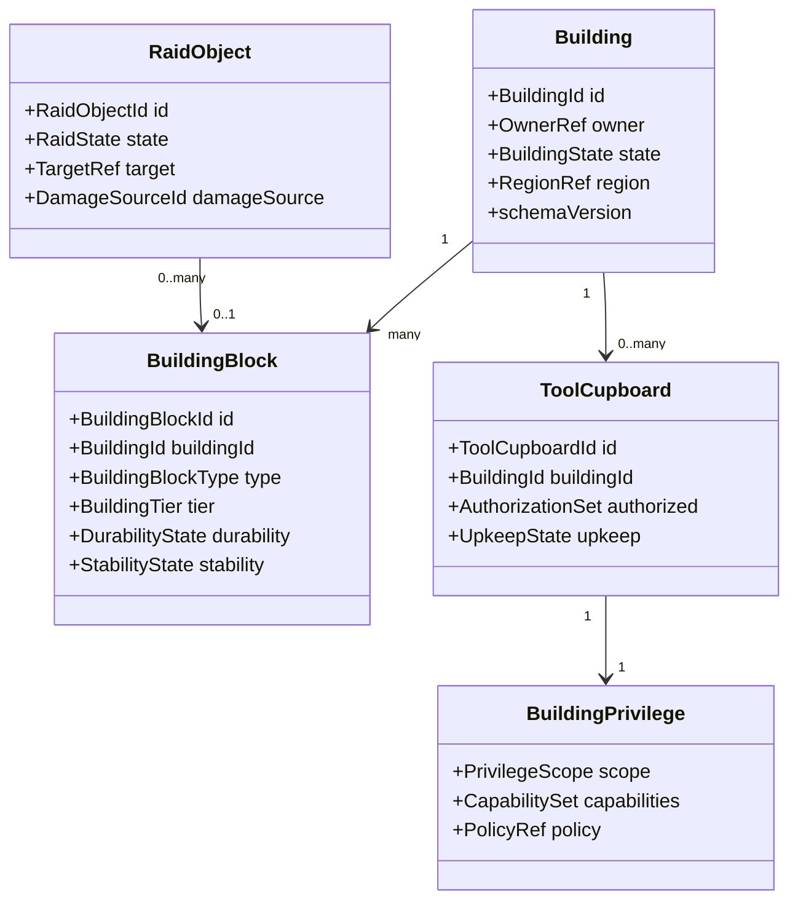

# RustCraft Domain Model

## 1. Назначение документа

Этот документ описывает доменную модель RustCraft: основные игровые сущности, их идентификаторы, жизненный цикл, состояние, владение, сериализацию и persistence model. Документ не содержит реализации игровых механик, Minecraft-кода, регистрации предметов, блоков, рецептов, монументов или NPC.

Цель модели — дать стабильный язык для будущих контрактов `rustcraft-api`, JSON-конфигураций, persistence-слоя, admin tooling, UI-проекций и модульных интеграций. Все сущности описаны как data/domain models, а не как Minecraft registry entries.

## 2. Принципы доменной модели

1. **Domain-first:** сущности описываются в терминах RustCraft, а не в терминах конкретных классов Minecraft.
2. **Stable identity:** каждая persistence-сущность имеет стабильный идентификатор, не зависящий только от координат или имени.
3. **Explicit ownership:** владение игроком, кланом, сервером или системой указывается явно и сериализуется.
4. **Immutable snapshots:** состояние, отдаваемое между модулями, должно быть snapshot-oriented и безопасным для чтения.
5. **JSON-compatible serialization:** данные проектируются так, чтобы сериализоваться в JSON-compatible representation с версией схемы.
6. **Wipe-aware persistence:** каждая сущность определяет, сохраняется ли она между wipe, сбрасывается ли частично или мигрирует.
7. **No direct module coupling:** модели доступны через `rustcraft-api`; игровые модули не импортируют классы друг друга.
8. **No Minecraft content registration:** `Item`, `Building Block`, `NPC` и `Monument` здесь являются абстрактными доменными моделями, а не регистрацией контента.

## 3. Общие идентификаторы и ownership-модель

| Идентификатор | Назначение | Формат на уровне домена |
| --- | --- | --- |
| `PlayerId` | Стабильный игрок RustCraft | UUID игрока или server-scoped UUID alias |
| `ClanId` | Группа игроков | UUID/ULID, не имя клана |
| `BuildingId` | База/структура | ULID/UUID, создается при появлении первой устойчивой структуры |
| `BuildingBlockId` | Элемент building graph | ULID/UUID + ссылка на `BuildingId` |
| `ToolCupboardId` | Объект авторизации building privilege | ULID/UUID + ссылка на `BuildingId` |
| `LootContainerId` | Абстрактный контейнер добычи | ULID/UUID или deterministic world-source id |
| `LootTableId` | Таблица добычи | Namespaced id: `rustcraft:loot/<name>` |
| `ItemId` | Абстрактный item definition | Namespaced id: `rustcraft:item/<name>` или external namespace |
| `ItemStackId` | Конкретный stack instance | ULID/UUID для tracked stacks, optional для transient stacks |
| `InventoryId` | Контейнер слотов | ULID/UUID + owner reference |
| `EquipmentId` | Набор экипировки | ULID/UUID + actor reference |
| `RaidObjectId` | Raid-сущность или raid-intent | ULID/UUID |
| `DamageSourceId` | Источник урона | Namespaced id или instance id для tracked source |
| `VehicleId` | Транспорт | ULID/UUID |
| `NpcId` | Конкретный NPC instance | ULID/UUID |
| `MonumentId` | Конкретный monument instance | ULID/UUID или deterministic map id |
| `SafeZoneId` | Зона безопасности | ULID/UUID или deterministic region id |
| `EconomyAccountId` | Экономический счет | Scope + stable owner id |

### 3.1 Owner Reference

`OwnerRef` — универсальная ссылка на владельца:

| Поле | Назначение |
| --- | --- |
| `ownerType` | `PLAYER`, `CLAN`, `SERVER`, `SYSTEM`, `NPC`, `NONE` |
| `ownerId` | Идентификатор владельца или `null` для `NONE` |
| `ownershipRole` | `OWNER`, `MEMBER`, `AUTHORIZED`, `CREATOR`, `ADMIN`, `SYSTEM_MANAGED` |
| `validFrom` | Время начала владения/права |
| `validUntil` | Optional expiration для временных прав |

### 3.2 Persistence scope

| Scope | Использование |
| --- | --- |
| `SERVER_GLOBAL` | Данные аккаунтов, стабильные профили, глобальные настройки |
| `WIPE_WORLD` | Данные текущего wipe: buildings, vehicles, loot containers, NPC instances |
| `PLAYER_PROFILE` | Данные игрока, которые могут переживать wipe по policy |
| `CLAN_PROFILE` | Данные клана и членства |
| `REGION` | Данные области мира, safe zone, monument state |
| `TRANSIENT_SESSION` | Данные, не сохраняемые после restart/wipe |

## 4. Entity Relationship Diagram

## 5. Ownership Diagram

## 6. Inventory Diagram

## 7. Building Diagram

## 8. Сущности доменной модели

### 8.1 Player

| Аспект | Модель |
| --- | --- |
| Идентификаторы | `PlayerId`, optional `PlayerSessionId`, ссылки на external platform UUID. |
| Жизненный цикл | `DISCOVERED` → `PROFILE_CREATED` → `ONLINE` → `OFFLINE` → `SUSPENDED`/`DELETED_BY_POLICY`. |
| Состояние | Профиль, активная сессия, clan memberships, inventory/equipment refs, economy accounts, permissions snapshot. |
| Владение | Player владеет личными inventory/equipment/economy accounts и может быть owner/member у building, vehicle и clan-owned объектов. |
| Сериализация | JSON object с `schemaVersion`, `playerId`, `profile`, `membershipRefs`, `stateRefs`, timestamps. Session-only поля сериализуются отдельно. |
| Persistence model | `PLAYER_PROFILE`; переживание wipe определяется policy. Session state — `TRANSIENT_SESSION`; combat/raid-sensitive временные данные — wipe/session scoped. |

### 8.2 Clan

| Аспект | Модель |
| --- | --- |
| Идентификаторы | `ClanId`, immutable; display name не является идентификатором. |
| Жизненный цикл | `CREATED` → `ACTIVE` → `DISBANDED` → `ARCHIVED`; membership может меняться независимо. |
| Состояние | Name, tag, owner/admin/member roles, invitations, shared authorizations, shared economy account refs. |
| Владение | Clan может владеть buildings, vehicles, shared inventories, tool cupboard authorizations и economy accounts. |
| Сериализация | JSON с `schemaVersion`, `clanId`, `display`, `memberships`, `ownedObjectRefs`, `auditMetadata`. |
| Persistence model | `CLAN_PROFILE`; может переживать wipe, но ссылки на wipe-world объекты очищаются при wipe migration. |

### 8.3 Building

| Аспект | Модель |
| --- | --- |
| Идентификаторы | `BuildingId`; создается при формировании устойчивого building graph. |
| Жизненный цикл | `PLANNED` → `ACTIVE` → `DECAYING` → `RAID_DAMAGED` → `COLLAPSED`/`REMOVED`. |
| Состояние | OwnerRef, region, block refs, tool cupboard refs, upkeep snapshot, privilege policy refs, raid exposure metadata. |
| Владение | Player-owned, clan-owned или server/system-owned; ownership может быть transferred через отдельную audited operation. |
| Сериализация | JSON с `schemaVersion`, `buildingId`, `owner`, `regionRef`, `blockRefs`, `toolCupboardRefs`, `state`, timestamps. |
| Persistence model | `WIPE_WORLD`; обычно удаляется на wipe. Для analytics может сохраняться archived summary в `SERVER_GLOBAL` audit storage. |

### 8.4 Building Block

| Аспект | Модель |
| --- | --- |
| Идентификаторы | `BuildingBlockId` + обязательная ссылка `BuildingId`; координаты являются location metadata, но не единственным identity. |
| Жизненный цикл | `PLACED` → `UPGRADED`/`REPAIRED` → `DAMAGED` → `DESTROYED`/`DECAYED`. |
| Состояние | Abstract block type, tier, durability, stability, placement transform, permissions metadata, optional parent/neighbor graph refs. |
| Владение | Наследует owner от `Building`, но может иметь creator ref для audit. |
| Сериализация | JSON с `schemaVersion`, `blockId`, `buildingId`, `type`, `tier`, `durability`, `stability`, `location`, graph refs. |
| Persistence model | `WIPE_WORLD`, region/chunk indexed. При разрушении может сохраняться tombstone для raid/audit windows. |

### 8.5 Tool Cupboard

| Аспект | Модель |
| --- | --- |
| Идентификаторы | `ToolCupboardId` + `BuildingId`; optional location ref. |
| Жизненный цикл | `PLACED` → `AUTHORIZING` → `UPKEEP_ACTIVE` → `DAMAGED` → `DESTROYED`/`REMOVED`. |
| Состояние | AuthorizationSet, upkeep inventory ref, upkeep policy snapshot, protected radius/graph scope, lock/access metadata. |
| Владение | Наследует owner от building или имеет explicit owner override в policy; grants authorization to players/clans. |
| Сериализация | JSON с `schemaVersion`, `toolCupboardId`, `buildingId`, `authorizedOwners`, `upkeepState`, `scope`, timestamps. |
| Persistence model | `WIPE_WORLD`; authorization history may be archived for admin audit. |

### 8.6 Loot Container

| Аспект | Модель |
| --- | --- |
| Идентификаторы | `LootContainerId`; deterministic id для world source или instance id для spawned/transient container. |
| Жизненный цикл | `SPAWNED` → `AVAILABLE` → `OPENED` → `LOOTED` → `RESPAWNING`/`DESPAWNED`. |
| Состояние | Loot source type, loot table ref, inventory ref, respawn policy, lock/claim metadata, monument/region refs. |
| Владение | Обычно `SYSTEM`; временное claim/access право может принадлежать player/clan по policy. |
| Сериализация | JSON с `schemaVersion`, `containerId`, `sourceType`, `lootTableId`, `inventoryRef`, `respawnState`, `regionRef`. |
| Persistence model | `WIPE_WORLD` или `REGION`; transient loot containers may be `TRANSIENT_SESSION`. Contents persist according to container policy. |

### 8.7 Loot Table

| Аспект | Модель |
| --- | --- |
| Идентификаторы | `LootTableId` namespaced, stable across config versions. |
| Жизненный цикл | `DECLARED` → `VALIDATED` → `ACTIVE` → `DEPRECATED`/`REPLACED`. |
| Состояние | Entries, weights, conditions, progression tier, roll policy, deterministic seed policy, economy value metadata. |
| Владение | `SYSTEM` или module-owned; admin profiles may override via config pack. |
| Сериализация | JSON config/data pack с `schemaVersion`, `lootTableId`, `entries`, `conditions`, `rollPolicy`, `compatibility`. |
| Persistence model | Config/data persistence, not world instance persistence. Active snapshot is cached; historical versions kept for migration/audit. |

### 8.8 Item

| Аспект | Модель |
| --- | --- |
| Идентификаторы | `ItemId` namespaced; не обязан совпадать с Minecraft item id. |
| Жизненный цикл | `DECLARED` → `VALIDATED` → `ACTIVE` → `DEPRECATED`/`REMOVED_BY_MIGRATION`. |
| Состояние | Category, stack policy, durability policy, economy value tags, loot tags, equipment compatibility, serialization metadata. |
| Владение | Item definition belongs to system/module; concrete ownership exists only у `ItemStack`. |
| Сериализация | JSON definition с `schemaVersion`, `itemId`, `category`, `policies`, `tags`; без регистрации Minecraft item. |
| Persistence model | Config/data definition; changes require migration for existing `ItemStack` references. |

### 8.9 Item Stack

| Аспект | Модель |
| --- | --- |
| Идентификаторы | `ItemStackId` для tracked stack; lightweight stack может иметь synthetic id only during transaction. |
| Жизненный цикл | `CREATED` → `STORED`/`EQUIPPED`/`IN_TRANSIT` → `SPLIT`/`MERGED` → `CONSUMED`/`DESTROYED`. |
| Состояние | ItemId, quantity, durability, quality/condition metadata, custom tags, origin/audit refs. |
| Владение | Через containing `Inventory`, `Equipment`, `LootContainer`, `Vehicle` или transient transaction owner. |
| Сериализация | JSON с `schemaVersion`, `stackId`, `itemId`, `quantity`, `durability`, `metadata`, `originRef`. |
| Persistence model | Persisted as part of inventory/equipment/container aggregate; transaction log optional for audit/economy. |

### 8.10 Inventory

| Аспект | Модель |
| --- | --- |
| Идентификаторы | `InventoryId`; owner ref обязательно, кроме transient inventories. |
| Жизненный цикл | `CREATED` → `ACTIVE` → `LOCKED`/`MIGRATING` → `ARCHIVED`/`DELETED`. |
| Состояние | Slot definitions, stack refs/embedded stacks, constraints, access policy, capacity, dirty/version marker. |
| Владение | Player, clan, vehicle, loot container, tool cupboard, NPC, server/system. |
| Сериализация | JSON aggregate с `schemaVersion`, `inventoryId`, `owner`, `slots`, `constraints`, `version`, timestamps. |
| Persistence model | Scope наследуется от owner: player inventory — `PLAYER_PROFILE` или wipe policy; containers/buildings/vehicles — `WIPE_WORLD`; transient — not persisted. |

### 8.11 Equipment

| Аспект | Модель |
| --- | --- |
| Идентификаторы | `EquipmentId` + actor ref (`PlayerId` или `NpcId`). |
| Жизненный цикл | `CREATED` → `ACTIVE` → `CHANGED` → `CLEARED`/`ARCHIVED`. |
| Состояние | Equipment slots, equipped item stack refs, restrictions, derived stat/effect tags. |
| Владение | Принадлежит actor; item stacks still tracked through equipment aggregate. |
| Сериализация | JSON с `schemaVersion`, `equipmentId`, `actorRef`, `slots`, `constraints`, `updatedAt`. |
| Persistence model | Player equipment follows player inventory policy; NPC equipment follows NPC instance policy. |

### 8.12 Raid Object

| Аспект | Модель |
| --- | --- |
| Идентификаторы | `RaidObjectId`; optional `RaidSessionId` for grouped actions. |
| Жизненный цикл | `CREATED` → `ARMED`/`ACTIVE` → `RESOLVED` → `EXPIRED`/`ARCHIVED`. |
| Состояние | Actor/source refs, target refs, damage source ref, raid tool type, policy snapshot, timing, audit/correlation id. |
| Владение | Обычно creator/actor player or clan; system-owned for admin simulations. |
| Сериализация | JSON с `schemaVersion`, `raidObjectId`, `actorRef`, `targetRef`, `damageSourceId`, `state`, `policySnapshot`. |
| Persistence model | `WIPE_WORLD` during active raid; resolved summary may be archived in audit storage according to retention policy. |

### 8.13 Damage Source

| Аспект | Модель |
| --- | --- |
| Идентификаторы | `DamageSourceId` namespaced for type-level source или instance id for tracked source. |
| Жизненный цикл | Type-level: `DECLARED` → `ACTIVE` → `DEPRECATED`; instance-level: `CREATED` → `APPLIED` → `EXPIRED`. |
| Состояние | Damage category, tags, raid applicability, scaling policy, attribution refs, environmental flags. |
| Владение | Type-level belongs to system/module; instance-level attributed to player/clan/NPC/system. |
| Сериализация | JSON definition for type-level; JSON event/snapshot for instance-level attribution. |
| Persistence model | Definitions are config/data; instance sources are transient or audit-persisted depending on raid/combat policy. |

### 8.14 Vehicle

| Аспект | Модель |
| --- | --- |
| Идентификаторы | `VehicleId`; location alone is not identity. |
| Жизненный цикл | `SPAWNED` → `OWNED`/`AVAILABLE` → `ACTIVE` → `DAMAGED`/`DECAYING` → `DESTROYED`/`DESPAWNED`. |
| Состояние | Vehicle type, owner, fuel state, health/durability, inventory refs, lock/access policy, passengers/operators, region ref. |
| Владение | Player, clan, server/system; access may be delegated through capabilities. |
| Сериализация | JSON с `schemaVersion`, `vehicleId`, `type`, `owner`, `state`, `fuel`, `inventoryRefs`, `location`. |
| Persistence model | `WIPE_WORLD`, region indexed; may be removed by decay/despawn policy. |

### 8.15 NPC

| Аспект | Модель |
| --- | --- |
| Идентификаторы | `NpcId` for instance, `NpcProfileId` for abstract profile. |
| Жизненный цикл | `SPAWN_REQUESTED` → `SPAWNED` → `ACTIVE` → `DESPAWNING`/`DEAD` → `REMOVED`. |
| Состояние | Profile ref, faction/allegiance, inventory/equipment refs, spawn source, behavior state snapshot, health state. |
| Владение | `SYSTEM` by default; may be associated with monument, event, safe zone or admin-spawn context. |
| Сериализация | Instance JSON snapshot with refs; profile JSON config. No Minecraft entity registration in this model. |
| Persistence model | Most NPC instances are `TRANSIENT_SESSION` or `WIPE_WORLD` if persistent patrol/monument state is required. Profiles are config/data. |

### 8.16 Monument

| Аспект | Модель |
| --- | --- |
| Идентификаторы | `MonumentId` for world instance, `MonumentTypeId` for abstract type. |
| Жизненный цикл | `DECLARED` → `PLACED` → `ACTIVE` → `DISABLED`/`REMOVED_BY_WIPE`. |
| Состояние | Region bounds, loot container refs, NPC spawn refs, safe zone refs, reset/respawn policies, map metadata. |
| Владение | `SYSTEM`; admin may disable/override through configuration. |
| Сериализация | JSON world snapshot/config with `schemaVersion`, `monumentId`, `typeId`, `region`, `sourceRefs`, `state`. |
| Persistence model | `WIPE_WORLD`/`REGION`; type definitions are config/data. No monument generation or placement implementation here. |

### 8.17 Safe Zone

| Аспект | Модель |
| --- | --- |
| Идентификаторы | `SafeZoneId`; optional relation to `MonumentId` or region id. |
| Жизненный цикл | `DECLARED` → `ACTIVE` → `SUSPENDED` → `REMOVED`. |
| Состояние | Region, protection policy, allowed/denied action capabilities, enforcement mode, notification/audit settings. |
| Владение | `SYSTEM`; managed by admin/server policy. |
| Сериализация | JSON с `schemaVersion`, `safeZoneId`, `region`, `policy`, `capabilityOverrides`, `state`. |
| Persistence model | `REGION` or config/data; active runtime projection can be rebuilt from config at startup. |

### 8.18 Economy Account

| Аспект | Модель |
| --- | --- |
| Идентификаторы | `EconomyAccountId` = account scope + owner ref + currency/profile namespace. |
| Жизненный цикл | `CREATED` → `ACTIVE` → `LOCKED`/`MIGRATING` → `CLOSED`/`ARCHIVED`. |
| Состояние | OwnerRef, balances by currency, transaction version, lock state, audit refs, debt policy. |
| Владение | Player, clan, server, system, NPC/vendor abstraction. |
| Сериализация | JSON с `schemaVersion`, `accountId`, `owner`, `balances`, `status`, `version`, `auditMetadata`. |
| Persistence model | `SERVER_GLOBAL` or `PLAYER_PROFILE`/`CLAN_PROFILE` depending on economy policy. Wipe behavior must be explicit: reset, keep, or migrate. |

## 9. Serialization contract

Все persistence-сущности должны сериализоваться по единому contract envelope:

| Поле | Назначение |
| --- | --- |
| `schemaVersion` | Версия схемы конкретной сущности. |
| `entityType` | Namespaced тип сущности: например `rustcraft:player`. |
| `entityId` | Стабильный идентификатор сущности. |
| `state` | Domain state без runtime-only объектов. |
| `owner` | Optional `OwnerRef`. |
| `refs` | Ссылки на другие агрегаты вместо глубокого циклического embedding. |
| `metadata` | Audit, timestamps, migration markers, source module. |

Runtime-only поля, Fabric/Minecraft handles, кеши, callbacks и service references не сериализуются.

## 10. Persistence aggregate boundaries

| Aggregate root | Содержит | Не содержит напрямую |
| --- | --- | --- |
| `Player` | Profile refs, session metadata refs, ownership refs | Полные building graphs, full inventories других владельцев |
| `Clan` | Memberships, shared ownership refs | Player private inventory data |
| `Building` | Building blocks, tool cupboard refs, upkeep refs | Полные player profiles |
| `Inventory` | Slots and item stacks | Item definitions beyond `ItemId` refs |
| `LootContainer` | Container state and inventory ref | Full loot table definition snapshot unless audit requires it |
| `Vehicle` | Vehicle state and inventory refs | Player profiles/passenger internals |
| `Monument` | Region/source refs | Full NPC AI runtime state |
| `EconomyAccount` | Balances and transaction version | Full transaction history beyond retention summary |

## 11. Следующие шаги без реализации

1. Создать `docs/architecture/data-contracts.md` с JSON envelope examples для каждой сущности.
2. Создать ADR по aggregate boundaries и wipe migration strategy.
3. Создать ADR по identity generation: UUID vs ULID vs deterministic ids.
4. Связать domain model с будущими `rustcraft-api` интерфейсами без написания кода.
5. Добавить архитектурную проверку, что игровые модули не создают прямые зависимости друг на друга.
