# RustCraft API Architecture

## 1. Назначение документа

`rustcraft-api` — фундаментальный контрактный модуль RustCraft. Он определяет стабильные публичные API, через которые игровые модули взаимодействуют друг с другом, с конфигурацией, persistence, networking, economy и будущими расширениями. На этом этапе документируется архитектура API без реализации игровых механик, предметов, блоков, игровых событий или регистрации Minecraft-контента.

Документ предназначен для долгосрочного развития проекта: API должен выдерживать несколько лет эволюции, поддерживать обратную совместимость, модульную разработку и независимые релизы игровых модулей.

## 2. Границы `rustcraft-api`

### 2.1 Что `rustcraft-api` содержит

- Контракты интерфейсов и data contracts.
- Описание event bus, service registry и module lifecycle.
- Абстракции capability, configuration, persistence и networking.
- Предметно-ориентированные контракты Building, Loot, Raid и Economy без реализации механик.
- Правила версионирования и совместимости.
- Extension points для модулей RustCraft и сторонних расширений.

### 2.2 Что `rustcraft-api` не содержит

- Игровую бизнес-логику.
- Реализации Building, Loot, NPC, Raiding или Economy.
- Регистрацию предметов, блоков, сущностей, команд или игровых событий Minecraft.
- Прямые зависимости на игровые модули.
- Хранение mutable global state без явного lifecycle-owner.

## 3. Общие архитектурные правила API

1. Все игровые модули зависят от `rustcraft-api`, но `rustcraft-api` не зависит от игровых модулей.
2. Межмодульная коммуникация выполняется через события, сервисы и capabilities API.
3. API-контракты проектируются от абстракций, а не от конкретных реализаций Fabric/Minecraft.
4. Minecraft/Fabric типы допускаются только в адаптерных контрактах, где невозможно сохранить полезность API без игрового контекста.
5. Data contracts должны быть immutable или фактически immutable.
6. Все конфигурируемые области должны иметь JSON Schema и версионированный config contract.
7. Удаление публичного API допускается только через deprecation window и major-version изменение.
8. Extension points должны быть безопасны для отсутствующих модулей: потребитель API не должен падать, если провайдер сервиса не установлен.

## 4. Высокоуровневая UML-диаграмма API

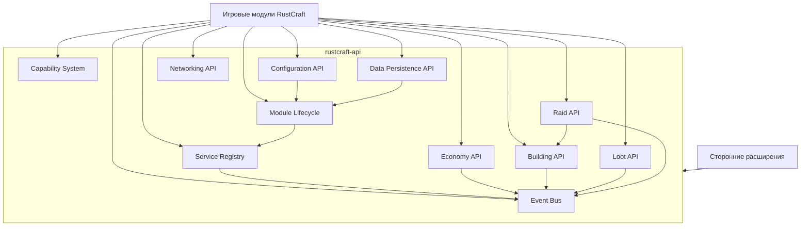

Связь `Raid --> Building` на диаграмме означает зависимость доменного контракта Raid API от абстрактных building-contract identifiers, а не зависимость `rustcraft-raids` от `rustcraft-building`.

## 5. Event Bus

### 5.1 Назначение

Event Bus обеспечивает слабосвязанную коммуникацию между модулями. Он нужен, чтобы модуль мог публиковать факт изменения или запросить участие других модулей без прямого импорта их классов.

Event Bus не должен быть заменой service calls для синхронных бизнес-операций. Он используется для событий домена, lifecycle notifications, audit events и extension hooks.

### 5.2 Интерфейсы

| Интерфейс | Назначение |
| --- | --- |
| `RustCraftEvent` | Базовый marker-contract события. |
| `EventType<TEvent>` | Типизированный идентификатор события. |
| `EventPublisher` | Публикация событий. |
| `EventSubscriber` | Подписка на события. |
| `EventSubscription` | Disposable handle подписки. |
| `EventContext` | Метаданные публикации: module id, correlation id, server tick, source. |
| `CancellableEvent` | Контракт для pre-events, которые можно отменить. |
| `EventPriority` | Порядок обработки подписчиков. |
| `EventResult` | Результат обработки: continue, stop propagation, cancel. |

### 5.3 Точки расширения

- Регистрация новых `EventType` через API namespace.
- Подписка сторонних модулей на публичные события.
- Event interceptors для audit, metrics и debugging.
- Correlation id propagation для трассировки цепочек действий.
- Асинхронные обработчики только для событий, явно отмеченных как async-safe.

### 5.4 Правила совместимости

- Event type id не меняется после публикации стабильного API.
- Добавление optional field в event payload совместимо.
- Удаление или переименование поля несовместимо.
- Смена sync/async семантики события несовместима.
- Cancellable-события нельзя делать non-cancellable в minor-релизе.
- События должны документировать порядок публикации относительно lifecycle и persistence.

### 5.5 UML

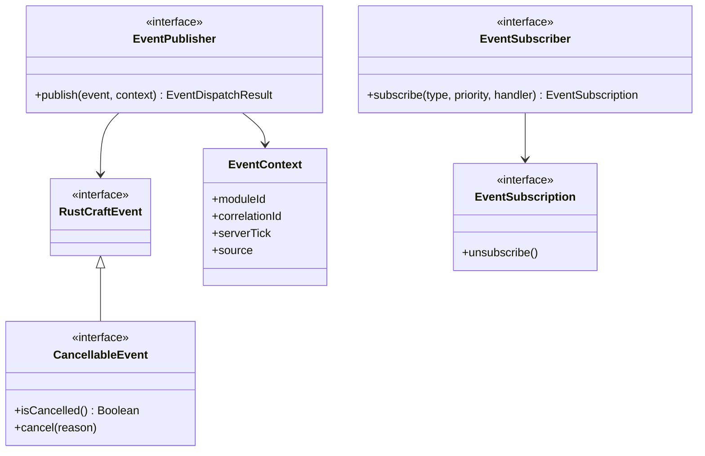

## 6. Service Registry

### 6.1 Назначение

Service Registry — каталог сервисов, доступных модулям через API. Он заменяет прямые зависимости между игровыми модулями и позволяет позднюю привязку реализаций.

### 6.2 Интерфейсы

| Интерфейс | Назначение |
| --- | --- |
| `ServiceKey<TService>` | Типизированный ключ сервиса. |
| `ServiceRegistry` | Получение и проверка сервисов. |
| `ServiceRegistrar` | Регистрация сервисов владельцем модуля. |
| `ServiceHandle<TService>` | Безопасный handle с lifecycle metadata. |
| `OptionalService<TService>` | Представление optional dependency. |
| `ServiceDescriptor` | Описание сервиса: owner, version, capabilities, stability. |
| `ServiceScope` | Scope сервиса: server, world, player, session. |

### 6.3 Точки расширения

- Регистрация module-owned сервисов.
- Optional service discovery для интеграций.
- Service decorators для metrics/audit.
- Versioned service contracts.
- Lazy resolution после lifecycle phase `READY`.

### 6.4 Правила совместимости

- `ServiceKey` стабилен и не переименовывается без major-релиза.
- Сервис может расширяться новыми optional методами только через новый contract interface или capability.
- Регистрация двух mandatory сервисов с одинаковым ключом запрещена.
- Optional сервисы должны иметь fallback behavior.
- Сервис не должен использоваться до соответствующей lifecycle phase.

### 6.5 UML

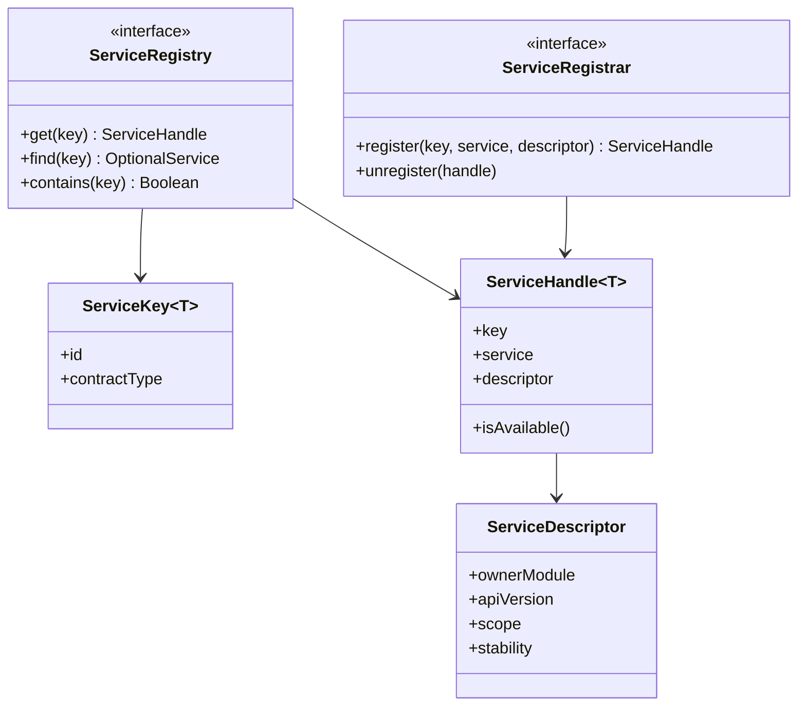

## 7. Module Lifecycle

### 7.1 Назначение

Module Lifecycle определяет предсказуемые этапы запуска, перезагрузки, остановки и hot-reload конфигурации. Он нужен, чтобы сервисы, события и persistence инициализировались в правильном порядке.

### 7.2 Интерфейсы

| Интерфейс | Назначение |
| --- | --- |
| `RustCraftModule` | Базовый контракт модуля. |
| `ModuleMetadata` | Id, name, version, dependencies, compatibility. |
| `ModuleLifecycleContext` | Доступ к API во время lifecycle phase. |
| `ModuleLifecyclePhase` | DISCOVERED, CONFIGURED, SERVICES_REGISTERED, READY, RELOADING, STOPPING, STOPPED. |
| `ModuleDependency` | Mandatory/optional dependency на API capability или сервис. |
| `ReloadableModule` | Контракт safe config reload. |
| `ModuleHealth` | Диагностика readiness/liveness. |

### 7.3 Точки расширения

- Lifecycle listeners.
- Health checks.
- Config reload hooks.
- Module dependency validation.
- Ordered startup based on API capability requirements.

### 7.4 Правила совместимости

- Lifecycle phase names и порядок стабильны.
- Новый lifecycle phase можно добавить только с safe default behavior.
- Module id immutable.
- Reload должен быть transactional: если новая конфигурация невалидна, старая остается активной.
- Модуль не должен публиковать gameplay-domain события до `READY`.

### 7.5 UML

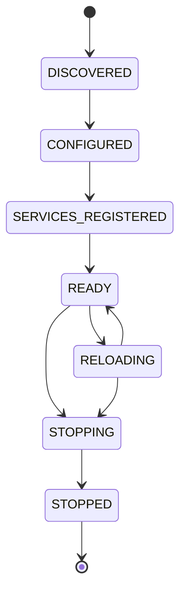

## 8. Capability System

### 8.1 Назначение

Capability System описывает динамически доступные возможности игроков, объектов, территорий, модулей и сервисов. Он нужен для расширяемых проверок прав и возможностей без жесткой связи между модулями.

### 8.2 Интерфейсы

| Интерфейс | Назначение |
| --- | --- |
| `CapabilityKey<TCapability>` | Типизированный ключ capability. |
| `CapabilityHolder` | Объект, владеющий capabilities. |
| `CapabilityProvider` | Провайдер capability для holder. |
| `CapabilityResolver` | Разрешение capability с учетом context. |
| `CapabilityContext` | Actor, world, position, reason, module id. |
| `CapabilityResult` | Allowed, denied, unknown с reason. |
| `CapabilityPolicy` | Правило объединения нескольких providers. |

### 8.3 Точки расширения

- Новые capability keys для доменных возможностей.
- Provider chaining.
- Policy overrides для server profiles.
- Audit hooks для denied/allowed decisions.
- Temporary/session capabilities.

### 8.4 Правила совместимости

- Capability key id стабилен.
- `unknown` не должен трактоваться как `allowed` для security-sensitive операций.
- Добавление нового denial reason совместимо.
- Изменение default policy должно быть major change или config-driven.
- Capability provider не должен выполнять тяжелую I/O операцию в sync game tick path.

### 8.5 UML

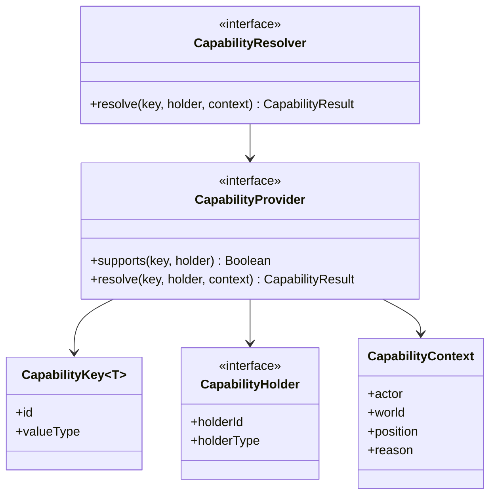

## 9. Configuration API

### 9.1 Назначение

Configuration API обеспечивает загрузку, валидацию, миграцию и hot-reload JSON-конфигураций. Все модули обязаны описывать конфигурации как JSON-compatible data contracts.

### 9.2 Интерфейсы

| Интерфейс | Назначение |
| --- | --- |
| `ConfigKey<TConfig>` | Типизированный ключ конфигурации. |
| `ConfigSchema` | Ссылка на JSON Schema и версию схемы. |
| `ConfigSource` | Источник конфигурации: default, file, profile, remote. |
| `ConfigLoader` | Загрузка и десериализация JSON. |
| `ConfigValidator` | Валидация against JSON Schema и semantic rules. |
| `ConfigMigrator` | Миграция между версиями config schema. |
| `ConfigSnapshot<TConfig>` | Immutable snapshot активной конфигурации. |
| `ConfigReloadResult` | Success/failure с diagnostics. |

### 9.3 Точки расширения

- Module-specific schemas.
- Semantic validators сверх JSON Schema.
- Config profiles для Alpha/Beta/Production.
- Safe hot-reload hooks.
- Secret redaction для admin diagnostics.

### 9.4 Правила совместимости

- Новые optional config fields совместимы.
- Новые required fields требуют default или migrator.
- Смена meaning существующего поля несовместима без migration strategy.
- Invalid config не должен активироваться.
- JSON Schema id должен быть стабильным внутри major version.

### 9.5 UML

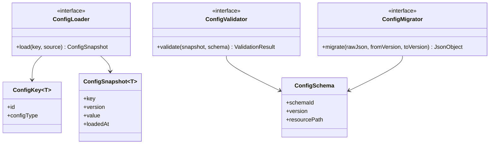

## 10. Data Persistence API

### 10.1 Назначение

Data Persistence API описывает хранение server/world/player/module state без привязки игровых модулей к конкретной базе данных или файлам. API должен поддерживать wipe-серверы, миграции данных, snapshots и recovery.

### 10.2 Интерфейсы

| Интерфейс | Назначение |
| --- | --- |
| `PersistenceKey<TData>` | Типизированный ключ persistent data. |
| `PersistenceStore` | Абстракция чтения/записи данных. |
| `PersistenceScope` | Server, world, chunk, player, group, module. |
| `PersistenceTransaction` | Transaction boundary. |
| `DataCodec<TData>` | Сериализация/десериализация. |
| `DataMigration` | Версионированная миграция persisted data. |
| `DataSnapshot` | Snapshot для backup/recovery. |
| `WipePolicy` | Правила очистки данных на wipe. |

### 10.3 Точки расширения

- Новые persistence stores.
- Module-owned codecs.
- Migration registry.
- Snapshot hooks.
- Wipe profiles.
- Read-through/write-behind cache adapters.

### 10.4 Правила совместимости

- Persistent key id нельзя менять без migration.
- Data schema version хранится вместе с данными.
- Миграции должны быть forward-only и deterministic.
- Wipe-sensitive данные обязаны явно указывать policy.
- API не должен требовать синхронной disk I/O в tick path.

### 10.5 UML

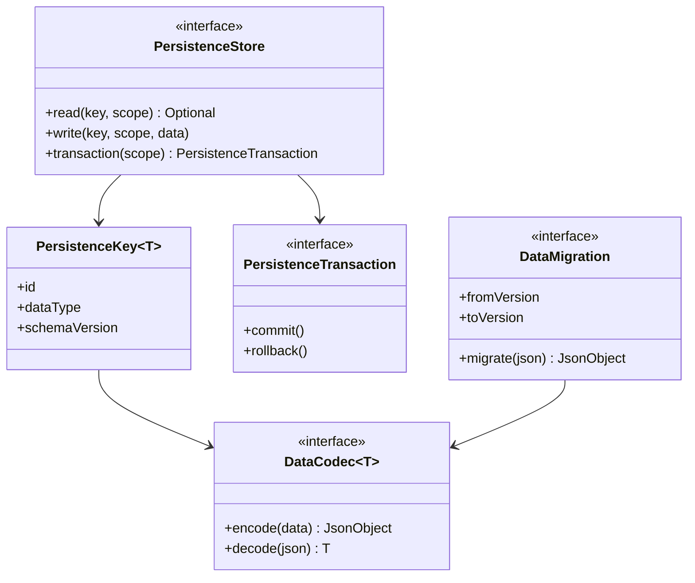

## 11. Networking API

### 11.1 Назначение

Networking API описывает безопасный обмен сообщениями между серверными модулями, сервером и будущими client-facing UI/overlay интеграциями. На текущем этапе API проектируется как контракт, без регистрации пакетов Minecraft и без реализации сетевого транспорта.

### 11.2 Интерфейсы

| Интерфейс | Назначение |
| --- | --- |
| `NetworkChannelKey` | Идентификатор канала. |
| `NetworkMessage` | Базовый контракт сообщения. |
| `MessageCodec<TMessage>` | Кодирование/декодирование сообщений. |
| `MessageHandler<TMessage>` | Обработчик сообщения. |
| `NetworkEndpoint` | Server, player, module endpoint. |
| `NetworkRouter` | Маршрутизация сообщений. |
| `NetworkPermissionPolicy` | Проверка права отправки/получения. |
| `RateLimitPolicy` | Ограничение частоты сообщений. |

### 11.3 Точки расширения

- Новые каналы для API-level сообщений.
- Codec registry.
- Permission policies.
- Rate limiters.
- Observability interceptors.
- Future client UI synchronization contracts.

### 11.4 Правила совместимости

- Network channel id стабилен.
- Message schema version обязательна.
- Добавление optional field совместимо.
- Обработчики должны проверять permissions и trust boundary.
- Сетевые сообщения не должны напрямую запускать gameplay mutation без validation layer.

### 11.5 UML

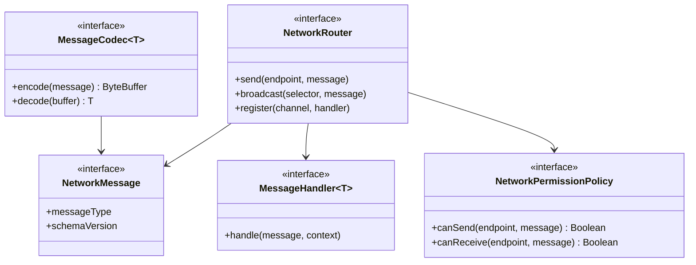

## 12. Economy API

### 12.1 Назначение

Economy API задает контракты ценности, баланса, транзакций и vendor-like взаимодействий. В Alpha экономика не выделена в отдельный модуль, поэтому API должен позволять будущему модулю экономики подключиться без переписывания Loot, Admin или Progression интеграций.

### 12.2 Интерфейсы

| Интерфейс | Назначение |
| --- | --- |
| `CurrencyKey` | Идентификатор валюты или value unit. |
| `AccountId` | Идентификатор аккаунта игрока, команды, NPC или сервера. |
| `MoneyAmount` | Immutable сумма в currency. |
| `EconomyService` | Чтение баланса и выполнение транзакций. |
| `TransactionRequest` | Запрос транзакции. |
| `TransactionResult` | Результат транзакции. |
| `PriceProvider` | Источник цен для item/resource abstractions. |
| `VendorContract` | Контракт vendor-like взаимодействия. |
| `EconomyAuditEvent` | Audit-событие экономики. |

### 12.3 Точки расширения

- Новые currency types.
- Vendor providers.
- Dynamic pricing policies.
- Admin audit exporters.
- Offline account support.
- Integration hooks для loot rewards и future shops.

### 12.4 Правила совместимости

- Currency key immutable.
- Денежные операции должны быть atomic в пределах persistence transaction.
- Negative balances запрещены по умолчанию, если policy явно не разрешает debt.
- PriceProvider должен иметь deterministic response для одного snapshot конфигурации.
- Economy API не должен зависеть от конкретных предметов Minecraft.

### 12.5 UML

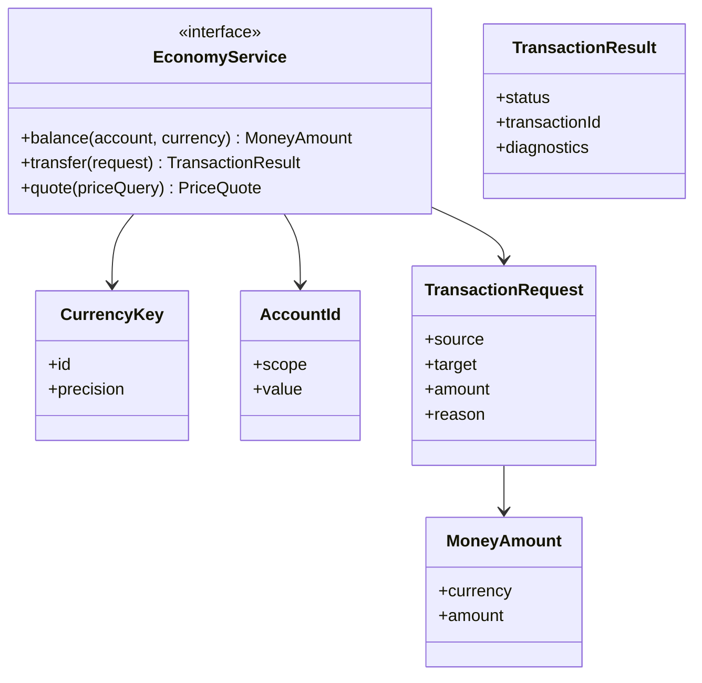

## 13. Building API

### 13.1 Назначение

Building API описывает доменные контракты строительства, владения, авторизации, durability и upkeep без реализации блоков, предметов или Minecraft-регистраций. Он нужен, чтобы Raid, Admin, UI и будущие расширения могли работать с абстрактными building-сущностями через API.

### 13.2 Интерфейсы

| Интерфейс | Назначение |
| --- | --- |
| `BuildingId` | Идентификатор building structure/base. |
| `BuildingElementId` | Идентификатор элемента постройки. |
| `BuildingElementType` | Абстрактный тип элемента: foundation, wall, door, deployable и т. п. без привязки к blocks. |
| `BuildingTier` | Материал/уровень прочности как domain tier. |
| `BuildingPrivilegeService` | Проверка building privilege/authorization. |
| `BuildingQueryService` | Чтение состояния building-сущностей. |
| `BuildingMutationRequest` | Абстрактный запрос изменения building state. |
| `BuildingDamageProfile` | Доменный профиль прочности для Raid API. |
| `UpkeepPolicy` | Правила upkeep как конфигурируемый contract. |
| `BuildingCapabilityKeys` | Capability keys для build/upgrade/demolish/open/authorize. |

### 13.3 Точки расширения

- Новые building tiers.
- Новые abstract element types.
- Privilege providers.
- Upkeep calculators.
- Raid damage adapters.
- Admin inspection hooks.
- UI state projection providers.

### 13.4 Правила совместимости

- Building IDs и element IDs не должны зависеть от координат как единственного источника идентичности.
- Новые element types совместимы, если имеют fallback category.
- Raid API должен использовать `BuildingDamageProfile`, а не классы building-модуля.
- Privilege decisions проходят через Capability System.
- Building API не регистрирует Minecraft blocks/items и не описывает конкретные рецепты.

### 13.5 UML

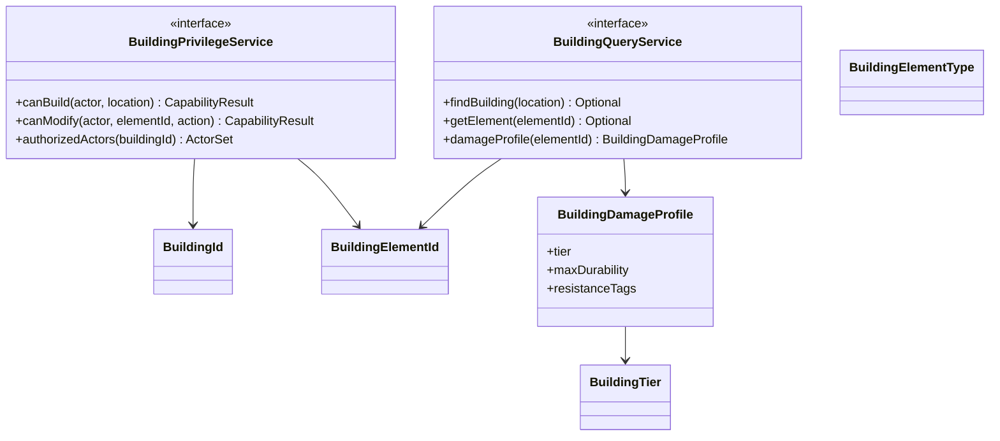

## 14. Loot API

### 14.1 Назначение

Loot API задает контракты loot tables, loot sources, progression tiers и rewards без реализации предметов, контейнеров, блоков или Minecraft-регистраций. Он нужен для интеграции World, Admin, Economy, UI и будущих модулей progression.

### 14.2 Интерфейсы

| Интерфейс | Назначение |
| --- | --- |
| `LootTableId` | Идентификатор loot table. |
| `LootSourceId` | Идентификатор источника loot. |
| `LootSourceType` | Абстрактный тип источника: barrel, crate, monument, npc, event. |
| `LootRollContext` | Context roll: actor, location, source, progression, modifiers. |
| `LootRollService` | Выполнение loot roll через контракт. |
| `LootEntry` | Абстрактная reward entry без привязки к Minecraft item. |
| `LootReward` | Результат roll как data contract. |
| `ProgressionTier` | Уровень прогрессии. |
| `LootModifier` | Расширяемый модификатор roll. |
| `LootAuditEvent` | Audit-событие loot generation. |

### 14.3 Точки расширения

- Новые loot source types.
- Loot modifiers для server profiles.
- Progression gates.
- Economy value providers для rewards.
- Admin dry-run/simulation providers.
- World integration через abstract source placement metadata.

### 14.4 Правила совместимости

- Loot table id стабилен.
- LootEntry должен иметь serializable abstract reward descriptor.
- Новые reward descriptor types требуют fallback или capability check.
- Loot roll должен быть reproducible при одинаковом seed/context, если модуль заявляет deterministic mode.
- Loot API не должен ссылаться на конкретные Minecraft item ids как обязательный contract.

### 14.5 UML

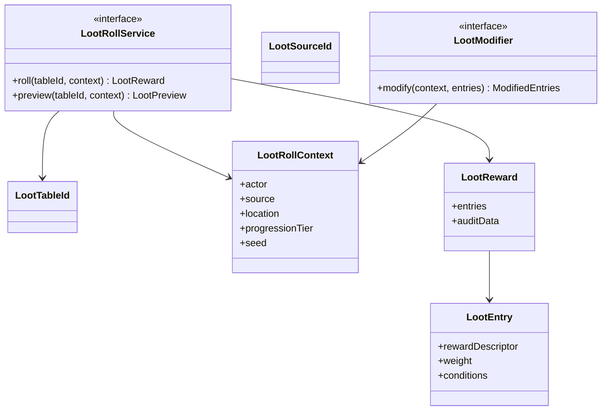

## 15. Raid API

### 15.1 Назначение

Raid API задает контракты raid damage, explosive abstractions, raid windows, protection policies и audit без реализации взрывчатки, предметов, блоков или игровых событий. Он нужен для связи Raids, Building, Admin, UI и Economy через API.

### 15.2 Интерфейсы

| Интерфейс | Назначение |
| --- | --- |
| `RaidActionId` | Идентификатор raid-действия. |
| `RaidToolType` | Абстрактный тип raid-инструмента: explosive, projectile, melee, siege. |
| `RaidDamageRequest` | Запрос расчета raid damage. |
| `RaidDamageResult` | Результат расчета damage. |
| `RaidPolicyService` | Проверка разрешенности raid-действия. |
| `RaidDamageService` | Расчет damage против `BuildingDamageProfile`. |
| `RaidWindowPolicy` | Правила raid windows/offline policy. |
| `RaidProtectionProfile` | Настройки protection для building/player/team/server. |
| `RaidAuditEvent` | Audit-событие raid-действий. |
| `RaidCostModel` | Абстрактная оценка стоимости raid-действия для economy/admin analytics. |

### 15.3 Точки расширения

- Новые raid tool types.
- Server-specific raid policies.
- Offline raid protection providers.
- Damage modifiers.
- Admin analytics exporters.
- UI notification projections.
- Economy cost calculators.

### 15.4 Правила совместимости

- Raid API зависит только от abstract building damage contracts.
- Новые raid tool types должны иметь default category и documented damage behavior.
- Raid policies должны быть config-driven и auditable.
- Damage calculation должен быть deterministic для одинакового request/config snapshot.
- Raid API не регистрирует explosives/items и не вызывает Minecraft explosion mechanics напрямую.

### 15.5 UML

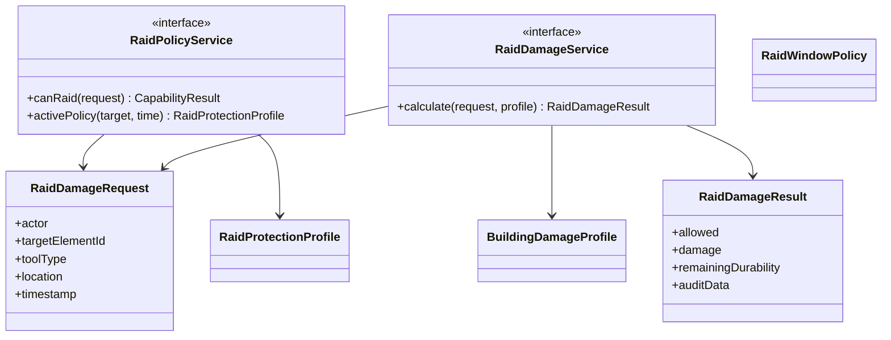

## 16. Примеры взаимодействия модулей

### 16.1 Raid модуль рассчитывает урон по building-элементу

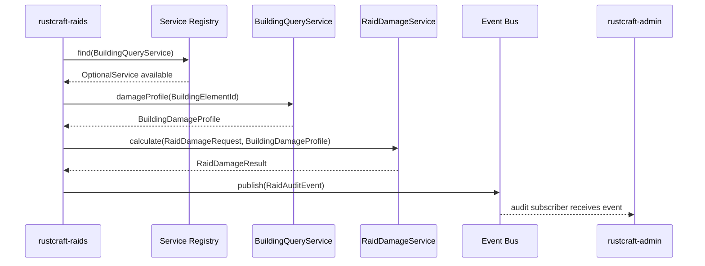

Правило: `rustcraft-raids` не импортирует классы `rustcraft-building`; он работает только с `BuildingQueryService` и `BuildingDamageProfile` из `rustcraft-api`.

### 16.2 Loot модуль публикует audit события для Admin и Economy

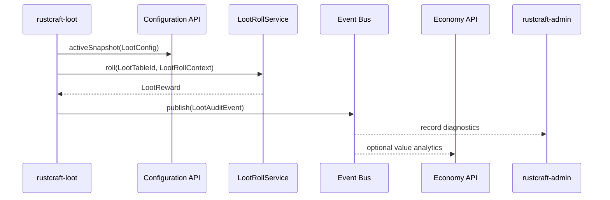

Правило: Economy получает абстрактные reward descriptors и value contracts, а не конкретные Minecraft item implementations.

### 16.3 UI запрашивает capability для отображения действия

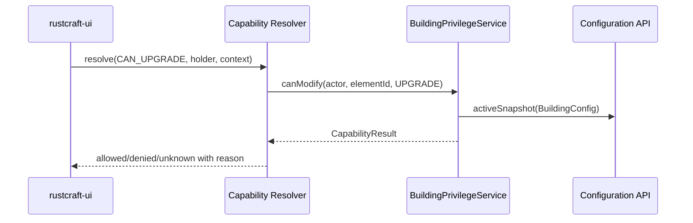

Правило: UI не принимает gameplay decisions самостоятельно; он отображает projection результата API.

### 16.4 Module Lifecycle регистрирует сервисы

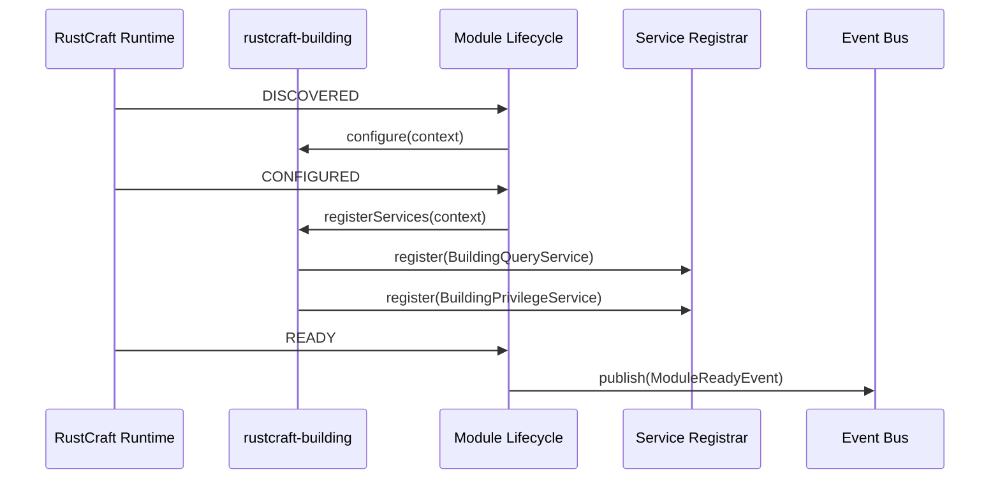

Правило: сервисы регистрируются до `READY`, а gameplay-domain events публикуются только после `READY`.

## 17. Совместимость и версионирование `rustcraft-api`

### 17.1 Уровни стабильности

| Уровень | Значение |
| --- | --- |
| `EXPERIMENTAL` | Может измениться в Alpha без гарантий совместимости. |
| `BETA` | Стабилизируется, breaking changes требуют migration note. |
| `STABLE` | Breaking changes только в major version. |
| `DEPRECATED` | Поддерживается до объявленного removal version. |

### 17.2 SemVer правила

- **Patch:** исправления документации, уточнение diagnostics, добавление non-breaking metadata.
- **Minor:** новые optional контракты, новые события, новые capabilities, новые extension points с safe default.
- **Major:** удаление API, переименование stable identifiers, изменение sync/async semantics, изменение security default.

### 17.3 Правила для всех API

- Любой публичный id должен быть namespaced: `rustcraft:<domain>/<name>` или `rustcraft-api:<domain>/<name>`.
- Breaking change требует ADR, migration plan и compatibility note.
- Optional dependencies должны разрешаться через `OptionalService` или capability check.
- Ошибка отсутствующего сервиса должна быть диагностируемой, а не приводить к silent failure.
- Все audit/event payloads должны иметь version и correlation id.

## 18. Следующие шаги без игрового кода

1. Создать ADR для Event Bus semantics: sync/async, ordering, cancellation, error handling.
2. Создать ADR для Service Registry lifecycle ownership.
3. Создать ADR для Configuration API и JSON Schema migration strategy.
4. Создать каталог будущих API identifiers и naming conventions.
5. Подготовить тестовую стратегию архитектурной совместимости: запрет прямых зависимостей между игровыми модулями, проверка стабильных ids и schema presence.
